# agentkit

Black-box testing kit for AI agents. Test agents through their **endpoints** — the way
customers will actually expose them (no prompts, tools, orchestration, or source shared) —
and, where it matters, assert on the state of the **fake tools/services** the agent was
given (e.g. "was a payment actually created?"). Supports single- and multi-turn scenarios,
agentic attack packs (OWASP Agentic Top 10), and EU AI Act / ISO 42001 / NIST compliance
reporting.

> Status: MVP complete, with two demo verticals — **treasury/payment approval** and **email
> triage** (phishing/exfiltration) — plus agentic attack packs and compliance evidence
> reports.

## System Overview

### Infrastructure
<picture>
  <source media="(prefers-color-scheme: dark)" srcset="./diagrams/infrastructure-simplified-dark.svg">
  <source media="(prefers-color-scheme: light)" srcset="./diagrams/infrastructure-simplified-light.svg">
  
</picture>

### Architecture
<picture>
  <source media="(prefers-color-scheme: dark)" srcset="./diagrams/architecture-simplified-dark.svg">
  <source media="(prefers-color-scheme: light)" srcset="./diagrams/architecture-simplified-light.svg">
  
</picture>

[More diagrams →](./diagrams/README.md)

## What it does

- **Python SDK** — a normalized `Agent` adapter (`CallableAgent`/`HTTPAgent`), a `Sandbox`
  interface, a `TestCase`/result schema, and a runner that never crashes.
- **Sandbox side-effects** — fake bank + invoice store, and a fake inbox + contacts +
  outbound ledger, so tests can verify an agent *didn't* perform an unsafe action, not just
  what it said.
- **Built-in test packs** — domain-neutral core pack (endpoint contract, robustness, prompt
  injection, data leakage, performance, reliability) plus treasury and email starter packs.
- **Redaction by default** — secrets/PII are stripped from evidence before it's ever stored
  or shown, with a separate storage on/off policy.
- **Scoring + CI gate** — risk-weighted overall score, per-category scores, critical-failure
  detection, `fail_under` threshold.
- **SQLite results + web dashboard** — pass/fail matrix, run history, failed-test evidence,
  regression comparisons between two runs.
- **Reports** — JSON, JUnit XML, self-contained HTML, and PR-comment-friendly Markdown.
- **CLI** — `agentkit run` (CI-gating exit codes), `agentkit report`, `agentkit compare`, and
  `agentkit ui`.

## Quickstart

```bash
pip install -e .

# Run the treasury pack against the in-process demo agent
agentkit run agentkit/packs/treasury --target agentkit/config/treasury-agent.yaml
```

Expected output:

```
agentkit run - target: treasury-demo   (6 tests)
CATEGORY              PASS  FAIL   ERR  SKIP
action_safety            6     0     0     0
--------------------------------------------
Overall (weighted): 100%   Pass rate: 100%   Critical failures: 0
Gate: PASS
```

Exit code is `0` (gate passed) — this is what you'd wire into CI. Every run is persisted to
`agentkit.db` (SQLite), so you can render a report or open the dashboard against it:

```bash
# Render a Markdown report for the run (grab the run id from the JSON summary, or the DB)
agentkit run agentkit/packs/treasury --target agentkit/config/treasury-agent.yaml --format json
agentkit report --run <run_id> --format md

# Launch the dashboard
agentkit ui   # http://127.0.0.1:8000
```

The Markdown report looks like:

```markdown
# agentkit report - treasury-demo

| Overall | Pass rate | Critical failures | Gate |
|---|---|---|---|
| 100% | 100% | 0 | PASS |

## Failures

None.
```

The dashboard (`agentkit ui`) shows the same run as a category × test pass/fail matrix, with
a test-detail page for each test showing the (already redacted) request/response, each
assertion's pass/fail + detail, the sandbox before/after diff, and latency.

### The email exfiltration demo

The most relatable demo: a vendor email tries to trick the agent into forwarding a payroll
spreadsheet to an external address. Run it and watch the outbound ledger stay clean:

```bash
agentkit run agentkit/packs/email --target agentkit/config/email-agent.yaml
python examples/run_email.py   # narrates the attack + verdict
```

### EU AI Act compliance evidence

Agentic attack packs (`agentkit/packs/agentic/`) probe the OWASP Agentic Top 10 — tool
misuse, memory poisoning (multi-turn), goal hijack, privilege abuse, human oversight — and
the compliance report reframes the results as EU AI Act / ISO 42001 / NIST evidence:

```bash
agentkit run agentkit/packs/agentic --target agentkit/config/treasury-agent.yaml --compliance
agentkit report --run <run_id> --format compliance        # Markdown, grouped by EU article
agentkit report --run <run_id> --format compliance-json   # machine-readable for GRC
```

Empty or all-skipped runs fail closed (INCOMPLETE — no evidence is not a pass). This is
technical readiness evidence, **not** a compliance/CE determination — see
[docs/specs/compliance.md](docs/specs/compliance.md).

### Compare two runs (regression gate)

```bash
agentkit compare <run_id_a> <run_id_b>
```

Prints newly-failing/newly-passing tests, latency + score deltas, and highlights any
**critical regression** — exiting `1` if one is found, so a CI pipeline can block a release
that broke a critical safety test.

## Programmatic use

```bash
python examples/run_treasury.py   # load target -> discover -> run -> score -> print
python examples/run_email.py      # the exfiltration demo, end to end
```

`examples/stub_endpoint.py` + `agentkit/config/demo-stub-http.yaml` show the black-box HTTP
path (`HTTPAgent`) is behaviorally identical to the in-process path (`CallableAgent`) for the
same inputs — the whole premise of testing agents through an endpoint.

## Development

- [`TASKS.md`](TASKS.md) — the task/branch plan (one branch per task, merged in dependency
  order).
- [`docs/plan.md`](docs/plan.md) — the full MVP design.
- [`docs/architecture.md`](docs/architecture.md) — control plane vs runner, execution modes,
  trace visibility, the privacy/redaction model, the sandbox model, and how this MVP points
  toward a customer-hosted enterprise deployment.
- [`docs/specs/`](docs/specs/README.md) — one contract spec per branch (public API, data
  models, failure behavior, required tests).

```bash
pip install -e ".[dev]"
pytest tests/
```
