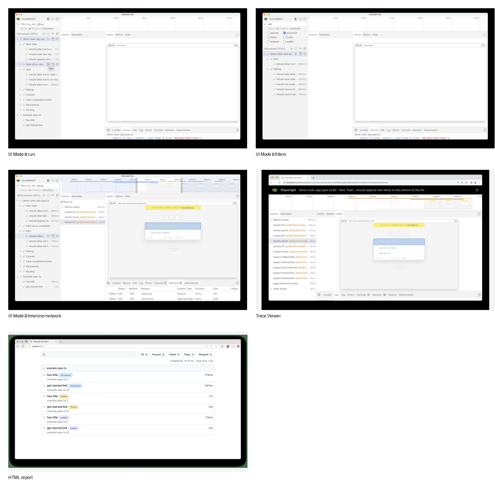
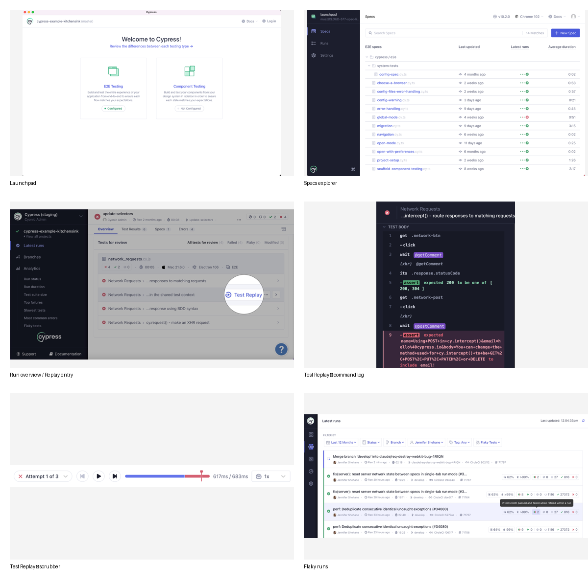

# Playwright and Cypress Dashboard UX Research

**Research date:** 2026-07-17  
**Scope:** Playwright UI Mode, Trace Viewer, HTML report, retries and project views; Cypress App Open Mode, Cypress Cloud runs, Test Replay, flaky-test management, analytics, account/project settings.  
**Source policy:** Official product documentation and official image assets were prioritized. Every visual reference below records its source and date. A single visibly older Cypress asset is retained only as a supplementary example and is clearly marked.

## Executive findings

Playwright and Cypress solve two related but different jobs:

- **Playwright is a compact, local-first debugging workbench.** Its strongest pattern is a dense, synchronized multi-pane view: test tree and filters on the left, a time-based trace and DOM snapshot in the center, and contextual diagnostics such as actions, source, errors, console, network, metadata, and attachments around the selected step.
- **Cypress spans a local runner and a cloud operations dashboard.** Its strongest pattern is a progressive journey from organization/project status to run overview, a prioritized “Tests for Review” queue, a specific test attempt, and Test Replay with command log, application state, DevTools data, artifacts, and a scrubber.
- **Both products minimize the distance from “something is wrong” to evidence.** Status is visible early, results can be narrowed before drilling in, and the detail view preserves context while exposing progressively deeper evidence.
- **The transferable pattern is not their branding or exact layout.** It is the hierarchy: overview → prioritized work queue → item detail → timeline/artifacts → raw evidence.

## Visual reference catalog

### Playwright

| ID | Visual | What it demonstrates | Official source | Source date | Local file |
|---|---|---|---|---|---|
| PW-01 | UI Mode — run and test tree | Hierarchical test navigation, inline run controls, selected test, trace workbench | [UI Mode documentation](https://playwright.dev/docs/test-ui-mode) | Current docs; accessed 2026-07-17. No per-page update date is published. | `references/playwright-ui-run.png` |
| PW-02 | UI Mode — filters | Search plus project/tag/status filtering close to the test tree | [UI Mode documentation](https://playwright.dev/docs/test-ui-mode) | Current docs; accessed 2026-07-17. | `references/playwright-ui-filters.png` |
| PW-03 | UI Mode — timeline and network | Time-range selection synchronized with action, console, and network evidence | [UI Mode documentation](https://playwright.dev/docs/test-ui-mode) | Current docs; accessed 2026-07-17. | `references/playwright-ui-timeline-network.png` |
| PW-04 | Trace Viewer | Action list, filmstrip/timeline, DOM snapshot, source and diagnostics | [Trace Viewer documentation](https://playwright.dev/docs/trace-viewer) | Current docs; accessed 2026-07-17. No per-page update date is published. | `references/playwright-trace-viewer.png` |
| PW-05 | HTML report | Summary counts, browser/project grouping, status-oriented report navigation | [Playwright introduction / HTML report example](https://playwright.dev/docs/intro) and [reporter documentation](https://playwright.dev/docs/test-reporters#html-reporter) | Current docs; accessed 2026-07-17. | `references/playwright-html-report.png` |

### Cypress

| ID | Visual | What it demonstrates | Official source | Source date | Local file |
|---|---|---|---|---|---|
| CY-01 | Cypress App Launchpad | Product/project setup as an explicit first step, browser and testing-type selection | [Open Mode documentation](https://docs.cypress.io/app/core-concepts/open-mode) | Documentation updated 2026-07-04; accessed 2026-07-17. | `references/cypress-launchpad.png` |
| CY-02 | Specs explorer | Searchable spec list and local execution entry point | [Open Mode documentation](https://docs.cypress.io/app/core-concepts/open-mode) | Documentation updated 2026-07-04; accessed 2026-07-17. **The image itself shows Cypress 10.2 and is supplementary, not evidence of the current visual skin.** | `references/cypress-spec-explorer.png` |
| CY-03 | Run overview / Test Replay entry | A run-level page that makes attempts and replay artifacts available from the failing test | [Test Replay documentation](https://docs.cypress.io/cloud/features/test-replay) | Documentation updated 2026-07-04; accessed 2026-07-17. | `references/cypress-run-overview-replay.jpg` |
| CY-04 | Test Replay command log | Command-centric step navigation beside the application under test | [Test Replay documentation](https://docs.cypress.io/cloud/features/test-replay) | Documentation updated 2026-07-04; accessed 2026-07-17. | `references/cypress-test-replay-command-log.png` |
| CY-05 | Test Replay scrubber | Time-based navigation through recorded application state | [Test Replay documentation](https://docs.cypress.io/cloud/features/test-replay) | Documentation updated 2026-07-04; accessed 2026-07-17. | `references/cypress-test-replay-scrubber.png` |
| CY-06 | Flaky runs | Status filtering and a dedicated view for flaky outcomes | [Flaky Test Management documentation](https://docs.cypress.io/cloud/features/flaky-test-management) | Documentation updated 2026-07-04; accessed 2026-07-17. | `references/cypress-flaky-runs.png` |

## Playwright UX analysis

### Information architecture and navigation

Playwright keeps the local debugging hierarchy shallow:

1. Test files and nested suites/tests in a left sidebar.
2. Search and filters for text, tag, project, and execution status.
3. A selected test opens a trace-oriented workbench.
4. Contextual tabs expose actions, metadata, source, call details, logs, errors, console, network, and attachments.
5. The separate HTML report provides a post-run entry point and links into trace evidence.

This is an **object-first information architecture**. The main object is the test; the main secondary object is an action in time. Almost every panel updates from those two selections.

### Dashboard hierarchy and page structure

- **HTML report:** aggregate status first, then browser/project or suite grouping, then individual tests and artifacts.
- **UI Mode:** test hierarchy on the left, temporal trace at the top, visual state in the center, detailed evidence in tabs.
- **Trace Viewer:** a focused diagnostic version of the same model, usable locally or as a static browser-hosted viewer.

The hierarchy is efficient because it avoids opening many unrelated pages. Selection changes the contents of adjacent panes while preserving the user’s place.

### Status, history, failures, retries, traces, screenshots, videos, logs and analytics

- Status filters include passed, failed, and skipped; retry semantics classify a test as passed, flaky, or failed.
- Traces can be captured on the first retry, all retries, failure retention, or every test.
- Trace evidence includes action snapshots, screencast/filmstrip screenshots, complete DOM snapshots, source location, call data, internal action logs, errors, browser/test console logs, network requests, metadata, and attachments.
- Video and screenshot artifacts are reporter/test configuration concerns rather than a rich historical SaaS dashboard.
- Playwright’s built-in experience is strongest for a **single run and a single failure**. Longitudinal analytics, team governance, ownership, and cross-run trend analysis are intentionally less central and are often supplied by CI/reporting integrations.

### Search, filtering, sorting, grouping and comparison

- Search by test text and tag.
- Filter by project and status.
- Hierarchical grouping by file, describe block, and test.
- Network data can be sorted by request type, status, method, content type, duration, and size.
- Visual-regression attachments support expected/actual/diff and an overlay slider.
- Timeline range selection filters actions, console, and network data to the same time window.

The synchronized filtering is a particularly strong pattern: one temporal selection narrows several evidence types without making the user repeat the same filter.

### States

- **Loading/running:** progress is visible at test and suite level while the workbench remains available.
- **Success:** green status and a trace that can still be inspected.
- **Warning/flaky:** represented through retry classification in reports rather than a large warning workflow in UI Mode.
- **Error:** red status, error marker on the timeline, Errors tab, and highlighted source line.
- **Empty/unselected:** detail panes are naturally inactive until a test or action is selected.
- **Unavailable dependency:** UI Mode explicitly does not automatically account for setup-test dependencies, creating a documented manual precondition rather than an integrated dependency state.

### Visual system

- Dense desktop layout with small but consistent controls.
- Neutral surfaces and borders; semantic colors carry status and timeline meaning.
- Monospace is reserved for code, locators, logs, and network data; UI text remains compact sans-serif.
- Tabs and pane boundaries organize high information density without card proliferation.
- Icons are functional and repeated: run, watch, filter, pop-out, copy, locator picker.
- Tables appear where comparison and sorting matter, especially network evidence.
- The interface is desktop-first. It depends on multiple visible panes and precise pointer/keyboard interactions; it is not a model to compress directly into a narrow mobile screen.

### High-level overview to a failed test

1. Open UI Mode or HTML report.
2. Filter to failed status or identify a red test in the tree/report.
3. Select the failed test.
4. Jump to the red timeline region or failing action.
5. Inspect before/action/after snapshots and error/source.
6. Correlate console and network evidence in the same time range.
7. Open attachments or pop out the DOM when deeper comparison is needed.

### What works well

- Very short path from failed status to exact failing action.
- Evidence stays synchronized around the selected test and time range.
- A single spatial model is reused across live debugging and trace review.
- Progressive disclosure keeps raw details available without showing all of them at once.
- Visual state, source, logs, and network are treated as peer evidence, reducing context switching.

### Friction

- The desktop workbench is visually dense and can present small targets.
- There is little built-in longitudinal/team dashboard functionality compared with Cypress Cloud.
- Setup-test dependencies require manual handling in UI Mode.
- The number of diagnostic tabs can require scanning and repeated switching.
- Status colors are helpful but should not be the only differentiator in an inspired design.

## Cypress UX analysis

### Information architecture and navigation

Cypress uses two connected products:

- **Cypress App / Open Mode:** Launchpad → Specs / Runs / Debug → Test Runner.
- **Cypress Cloud:** Organization → Project → Latest Runs → Run Details → Tests for Review / Test Results / Specs / Errors → test detail sidebar → Test Replay.
- **Administrative layer:** organization, projects, users, roles, SSO, billing/usage, integrations and project settings.
- **Analytics layer:** test health, performance, flake and organizational reporting.

This is a **workspace-and-history information architecture**. It supports teams that need to triage current failures while also managing projects and trends over time.

### Dashboard hierarchy and page structure

- A broad global/project shell provides organizational context.
- Latest Runs is the operational landing page.
- Run Details separates overview, test results, specs/machines/timeline, and errors.
- “Tests for Review” prioritizes failed, flaky, and modified tests rather than treating all results as equally urgent.
- A test-detail sidebar preserves run context while showing attempts, errors, prior runs, artifacts and code history.
- Test Replay becomes a dedicated deep-debugging surface with command log, AUT preview, DevTools information and scrubber.

### Status, history, failures, retries, traces, screenshots, videos, logs and analytics

- Recent run status and average duration can appear in the local Specs page using Cypress Cloud data.
- Recorded runs retain test attempts, errors, previous runs, screenshots, videos and Test Replay artifacts.
- Tests for Review creates a queue around failures, flake and relevant changes.
- Test Replay reconstructs CI execution and exposes commands, application state, console/network storage and a timeline/scrubber.
- Flake detection depends on retries and distinguishes a test that fails and later passes within a run.
- Analytics cover test health, flake, duration/performance and reporting across projects.
- Branch Review supports side-by-side comparison of branches and their replays.

### Search, filtering, sorting, grouping and comparison

- Search specs by name.
- Filter run/test results by statuses such as failed and flaky.
- Group and inspect run data through Overview, Test Results, Specs and Errors tabs.
- Specs can be viewed through timeline, bar chart and machine views.
- Test detail groups attempts, prior runs, artifacts and code history.
- Branch Review provides direct comparison; flaky analytics compare failure rate and flake rate across time/branches/projects.

### States

- **Empty/setup:** Launchpad makes unconfigured project and testing-mode selection explicit.
- **Loading/running:** run-in-progress panels and live recorded-run state.
- **Success:** passed runs and tests stay navigable, not simply dismissed.
- **Warning:** flaky outcomes, recommendations, usage/plan constraints and test-replay availability warnings.
- **Error:** Errors tab, attempt-level stack traces, failed commands, upload/network troubleshooting and platform status guidance.
- **Unavailable/disabled:** Replay can be unavailable because of plan, version, configuration, upload timeout, proxy/firewall or service incident.
- **Notification state:** desktop/cloud notifications are scoped to the relevant commit and run lifecycle.

### Visual system

- Strong global navigation and page headers for organization/project/run context.
- Status chips, icons, row emphasis and badges support scanability.
- Tables/lists dominate operational screens; cards and charts summarize analytics.
- Test Runner and Replay use a split-pane “command log + application under test” model.
- Purple/brand accents are proprietary and should not be copied; the reusable lesson is restrained neutral chrome plus semantic status.
- The cloud experience is more spacious than Playwright’s local workbench, but test detail and Replay remain desktop-dense.

### High-level overview to a failed test

1. Open the project’s Latest Runs.
2. Select a failed or warning run.
3. Review top-level duration, recommendations and Tests for Review.
4. Select a failed/flaky test without losing run context.
5. Inspect attempts, stack traces, prior runs and artifacts in the detail sidebar.
6. Open Test Replay.
7. Move through commands or the scrubber while inspecting the application and DevTools evidence.
8. Compare with another branch/run when the cause may be a regression.

### What works well

- Prioritized review queue converts a large run into an actionable workload.
- Run history, previous attempts and artifacts are linked directly to the test.
- Local App and Cloud share status/history data, reducing the gap between local and CI debugging.
- Analytics and flake workflows turn repeated failures into managed quality work rather than isolated incidents.
- The detail sidebar is an effective middle layer between a broad run and a full-screen replay.

### Friction

- Users may switch among Cypress App, Cypress Cloud and Test Replay, each with different scope and density.
- Some high-value features depend on plan, recording configuration or a recent Cypress version.
- Run pages contain many tabs, sidebars and views, which can be demanding for occasional users.
- Cloud analytics can encourage metric browsing without a clear next action unless recommendations and ownership are strong.
- Some official documentation retains older screenshots; current behavior and current visual styling must be distinguished.

## Playwright versus Cypress comparison

| Dimension | Playwright | Cypress | Transferable design lesson |
|---|---|---|---|
| Primary product model | Local runner/report/trace toolkit | Local runner plus team cloud dashboard | Design around the user’s operational level: individual workbench and team overview are different surfaces. |
| Main navigation object | Test tree and selected action | Organization/project/run/test/attempt | Keep stable object context visible during drill-down. |
| High-level prioritization | Status filters and report counts | Tests for Review, recommendations, failed/flaky/modified prioritization | Create a “needs attention” queue, not only an unranked list. |
| Deep debugging | Time-travel trace, DOM snapshots, source, console, network | Command log, AUT state, Replay scrubber, DevTools data, artifacts | Synchronize timeline, visible state and raw evidence. |
| Run history | Primarily report artifacts and CI integrations | First-class cloud history and previous runs | Historical context should be one click from the current item. |
| Retry/flake model | Passed/flaky/failed classification | Retry-driven flaky detection, severity and analytics | Make intermediate/recovered states visible; do not collapse them into success. |
| Search/filter | Text, tag, project, status; network sorting | Specs, run/test status, tabs/views, branch comparison | Put narrowing controls beside the list they affect and preserve them in URLs. |
| Comparison | Screenshot expected/actual/diff; trace ranges | Branch Review, prior runs, analytics comparisons | Provide purposeful comparisons rather than generic side-by-side layouts. |
| Density | Very high, IDE-like | Medium on dashboards; high in Runner/Replay | Offer density modes or adapt density by task and screen size. |
| Mobile suitability | Low for debugging workbench | Limited for deep debugging; cloud lists may reflow | Use a single-pane mobile drill-down instead of squeezing desktop panes. |
| Governance/settings | Minimal product-level governance | Organizations, roles, SSO, billing, project settings | Separate administration from operational workflows. |

## Shared patterns worth adopting

1. **A stable hierarchy.** Users always know the workspace/project, run/session, selected item and selected evidence step.
2. **Status at every level.** Aggregate status, row status, attempt/step status and artifact availability are distinct.
3. **Actionable prioritization.** Failures, flake, modifications or missing data are surfaced before routine successes.
4. **Progressive disclosure.** Summaries lead to item detail, then to timeline and raw evidence.
5. **Context-preserving drill-down.** Side panels, tabs and split panes reveal more without throwing away the parent context.
6. **Temporal navigation.** A scrubber, timeline or activity sequence makes state changes understandable.
7. **Evidence bundles.** Visual state, logs, errors, network, metadata and attachments are linked to the same selected event.
8. **Persistent filtering.** Search/filter/grouping controls sit close to the data and should be representable in the URL.
9. **Explicit non-happy paths.** Unavailable artifacts, failed uploads, empty projects and configuration prerequisites receive dedicated states.
10. **Neutral chrome plus semantic status.** Product identity can remain distinct while status and priority remain immediately legible.

## Patterns to avoid copying directly

- Brand colors, proprietary icons, product terminology, illustrations and exact component geometry.
- The exact Playwright multi-pane proportions or Cypress navigation structure.
- Desktop density on narrow screens.
- Status communicated only through red/green color.
- A generic “analytics” page without decisions or recommended actions.
- Splitting one user journey across several products unless a real architectural boundary requires it.

## Research limitations

- Playwright publishes current documentation but not a per-page last-updated date. The research date is therefore recorded as the verification date.
- Some Cypress documentation pages are current while individual image assets may depict an earlier visual version. The Specs explorer asset is marked accordingly and was not used as the sole basis for any current-style conclusion.
- Authenticated Cypress Cloud screens can vary by plan, organization configuration, feature rollout and data state.
- Responsive behavior is sparsely documented for both deep-debugging workbenches. Conclusions about mobile are based on the visible multi-pane interaction model and should be validated against live products if mobile parity becomes a strict requirement.

## Official sources

### Playwright

- [UI Mode](https://playwright.dev/docs/test-ui-mode)
- [Trace Viewer](https://playwright.dev/docs/trace-viewer)
- [Reporters and HTML reporter](https://playwright.dev/docs/test-reporters)
- [Retries](https://playwright.dev/docs/test-retries)
- [Projects](https://playwright.dev/docs/test-projects)
- [Release notes](https://playwright.dev/docs/release-notes)

### Cypress

- [Open Mode](https://docs.cypress.io/app/core-concepts/open-mode)
- [Introduction to Cypress Cloud](https://docs.cypress.io/cloud/get-started/introduction)
- [Recorded runs](https://docs.cypress.io/cloud/features/recorded-runs)
- [Test Replay](https://docs.cypress.io/cloud/features/test-replay)
- [Flaky Test Management](https://docs.cypress.io/cloud/features/flaky-test-management)
- [Analytics overview](https://docs.cypress.io/cloud/features/analytics/overview)
- [Users, roles and permissions](https://docs.cypress.io/cloud/account-management/users)
