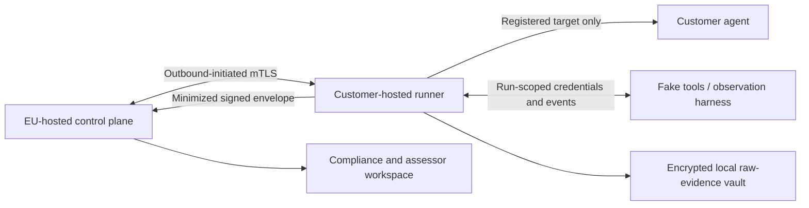

# EU AI Agent Compliance-Readiness Platform

## Summary

Develop Agentaudit as three connected products:

1. A technical agent-security scanner.
2. An EU compliance-readiness and evidence manager.
3. An assessor-ready workspace and signed dossier exporter.

It must never automatically label a system “EU compliant,” “certified,” or “CE approved.” Final conformity and legal conclusions remain with the provider, deployer, qualified assessor, or notified body where applicable.

As of 15 July 2026, Regulation (EU) 2024/1689 remains the binding baseline. The Digital Omnibus was signed on 8 July but is still awaiting Official Journal publication, so Agentaudit must display both the binding and pending timelines without merging them. [AI Act](https://eur-lex.europa.eu/eli/reg/2024/1689/oj), [Digital Omnibus status](https://oeil.europarl.europa.eu/oeil/en/procedure-file?reference=2025%2F0359%28COD%29).

The legal catalog will cover:

| Track | Initial requirements |
| --- | --- |
| Applicability | EU nexus, provider/deployer/value-chain roles, Article 5 prohibitions, Article 6 and Annex III high-risk classification, Article 25 role changes |
| High-risk providers | Articles 9–15 risk, data, documentation, logging, transparency, human oversight, accuracy, robustness and cybersecurity; Articles 17–21 QMS/records; 43, 49, 72–73 conformity, registration, monitoring and incidents |
| Deployers | Article 26 duties, Article 27 FRIA where applicable, Article 86 explanation |
| Transparency/GPAI | Article 50 transparency; Articles 53 and 55 where the customer is a GPAI provider or responsible downstream integrator |
| Privacy | Separate GDPR module: lawful basis, special data, automated decisions, privacy by design, processors, security, DPIA and transfers; informed by [EDPB Opinion 28/2024](https://www.edpb.europa.eu/system/files/documents/2024-12/edpb_opinion_202428_ai-models_en.pdf) |
| Conditional overlays | CRA for products with digital elements and NIS2 for covered entities; do not return a generic EU-wide pass for these regimes |

Harmonised standards remain voluntary and are still being developed. Only applicable standards referenced in the Official Journal should be represented as providing presumption of conformity. Store metadata and licensed citations, not unlicensed standards text. [European Commission standardisation status](https://digital-strategy.ec.europa.eu/en/policies/ai-act-standardisation).

## Target Architecture and Public Contracts

Use the selected hybrid, local-first model:

Raw prompts, responses, credentials and unrestricted traces stay within the customer environment. SaaS receives sanitized, signed evidence. This adds runner and protocol operational work but materially reduces the SaaS privacy and credential blast radius.

Introduce a versioned protocol rather than extending the current `RunResult` implicitly:

- Inventory and legal types: `AISystem`, immutable `SystemVersion`, `AssessmentScope`, `LegalSourceVersion`, `RequirementVersion`, `ApplicabilityDecision`, `ControlInstance`.
- Testing types: `PackManifest`, `AttackScenario`, `EvaluatorSpec`, `TargetCapabilitySet`, `RunAuthorization`, `RunManifest`, `Observation`, `EvaluationResult`.
- Evidence and review types: `EvidenceArtifact`, `SignedRunEnvelope`, `Finding`, `Remediation`, `ReviewDecision`, `Waiver`, `AuditEvent`.
- Every SaaS entity receives `tenant_id`; every wire object receives `schema_version`.
- Runs pin system version, target capabilities, model/tool/prompt/RAG/memory configuration, runner build, legal snapshot, pack/evaluator digests, corpus seed, evidence policy, timestamps and one-time nonce.
- Use DSSE envelopes with canonical JSON payloads, Ed25519 signatures and SHA-256 artifact digests. Signatures prove integrity and runner attribution, not that a customer-controlled runner is independently trustworthy.
- Introduce `SecretRef`; secret values must never enter manifests or SaaS storage.

Use explicit fail-closed outcomes:

- `TestOutcome`: `passed | failed | error | skipped | unsupported`.
- `RequirementState`: `satisfied | unsatisfied | unknown | not_applicable`.
- `EvidenceAssurance`: `self_attested | platform_observed | independently_verified`.
- `ReadinessState`: `gaps_found | incomplete | ready_for_human_review`.

Any mandatory missing, stale, unsigned, skipped, unsupported, errored or inconclusive evidence produces `incomplete`. Applicable failures produce `gaps_found`. Empty scopes never pass. `not_applicable` requires a cited rationale and assessor approval.

Expose `/api/v1` resources for systems and versions, assessments, registered targets, runner enrollment, run authorizations, signed packs, result-envelope ingestion, evidence, findings, reviews and exports. APIs accept stable IDs only—never caller-supplied filesystem paths.

## Ordered Implementation Tasks

### P0 — Make the evaluator trustworthy

The repository at `f2c0718` has 141 passing tests, but the current tests do not cover several security boundaries:

- The unauthenticated [web run route](/C:/Users/nicas/Desktop/agent-testkti/agentaudit/web/app.py:135) accepts target and pack paths that can lead to in-process Python execution.
- The [runner timeout](/C:/Users/nicas/Desktop/agent-testkti/agentaudit/core/runner.py:30) returns while the timed-out thread continues acting; result errors, assertion details and sandbox diffs also bypass complete redaction.
- [Scoring](/C:/Users/nicas/Desktop/agent-testkti/agentaudit/core/scoring.py:35) defaults to zero and treats empty/all-skipped runs as perfect passes.
- HTTP side-effect tests can inspect a disconnected fake sandbox and falsely conclude that no real-world action occurred.
- Current prompt-injection and leakage probes are small substring checks and are trivially bypassed.
- Built wheels omit templates, static assets, YAML packs and configurations.

Implement before any public or compliance-labelled release:

1. Keep local UI loopback-only with a generated access token; reject public binding without an explicit development override.
2. Add CSRF protection and prohibit web-triggered Python/callable loading. Replace paths with registered target and pack IDs.
3. Replace thread timeouts with killable process-tree isolation. Production untrusted tests use ephemeral rootless OCI jobs; subprocess mode is trusted local development only.
4. Mark side-effect tests `unsupported` unless an authenticated, run-scoped fake-tool/event harness proves the tested agent used the observed tools.
5. Apply one schema-aware sanitizer to the complete evidence envelope: values, keys, headers, URLs, errors, assertion details, diffs, events and numeric identifiers.
6. Replace free-form assertion arguments with strict versioned evaluator schemas, safe bounded regex, non-empty constraints and `extra="forbid"`.
7. Enforce HTTPS/approved endpoints, redirect restrictions, DNS/IP revalidation, response-size and JSON-depth limits, egress policy and whole-run budgets.
8. Make empty, all-skipped, partial, errored and unobservable runs fail closed.
9. Add wheel/sdist integration tests proving all runtime assets are packaged.
10. Add CI gates for pytest, Ruff, type checking, dependency audit, secret scanning and SBOM generation.

### P1 — Build the regulatory and assessment domain

1. Add SQLAlchemy repositories and Alembic migrations. Retain SQLite for local single-organization mode; use PostgreSQL for SaaS.
2. Import existing runs into a default organization as `legacy_unverified`; they remain technical history and cannot satisfy a legal requirement.
3. Implement immutable legal releases with statuses `binding`, `adopted_awaiting_oj`, `future_effective`, `draft_guidance`, `voluntary_standard` and `superseded`.
4. Require primary-source URI, publication/effective dates, content hash, retrieval time, legal-editor approval and second-person promotion approval.
5. Implement a restricted decision-table DSL for applicability; ambiguity returns human review. Do not use an LLM or `eval` for authoritative classification.
6. Build the system questionnaire covering intended purpose, EU roles, branding/substantial modification, sector, affected people, legal effects, public-authority use, data categories, children, model/GPAI relationship, tools, memory and external connectors.
7. Seed the AI Act requirements above, with GDPR separate and CRA/NIS2 conditional.
8. Allow customers to attach a snapshot from the Commission’s official Compliance Checker; do not scrape it or imply that Agentaudit replaces it. [Official AI Act Service Desk](https://digital-strategy.ec.europa.eu/en/news/commission-launches-ai-act-service-desk-and-single-information-platform-support-ai-act).

### P2 — Implement the customer-hosted runner and evidence protocol

1. Split runner and control plane into separately deployable trust domains; the control plane never calls customer targets.
2. Enroll runners using one-time tokens, workload identity and rotatable tenant-bound signing keys.
3. Let runners poll outbound over mTLS for signed, expiring `RunAuthorization` objects.
4. Permit SaaS-distributed declarative packs only. Trusted evaluator plugins ship with the runner; freeze the registry and reject duplicates.
5. Add run-scoped fake HTTP, OpenAPI and MCP services plus an attributable side-effect event ledger.
6. Add CPU, memory, PID, output, token, cost, concurrency, retry, tool-call and chain-depth budgets with cancellation and emergency kill switch.
7. Store raw evidence only in an encrypted local vault and only when explicitly enabled; default SaaS upload is minimized sanitized evidence.
8. Reject invalid signatures, replayed nonces, expired jobs, wrong-tenant keys, manifest mismatches, changed pack digests and revoked runner keys.
9. Support encrypted offline spooling and idempotent upload after connectivity returns.

### P3 — Build the multi-tenant control plane

1. Add organizations, projects, memberships, systems/versions, runners, assessments, controls, evidence, findings, waivers, reviews and audit events.
2. Enforce non-null `tenant_id`, application authorization and PostgreSQL row-level security on every SaaS record.
3. Use managed OIDC Authorization Code with PKCE, secure server sessions, CSRF protection and roles `org_admin`, `assessment_owner`, `runner_operator`, `assessor`, `viewer`.
4. Encrypt object storage, isolate tenant prefixes, malware-scan documentary uploads and exclude evidence payloads from application logs.
5. Add immutable state-transition audit events, rate/concurrency limits, retention/deletion jobs, backup/restore and key rotation.
6. Keep the existing `agentaudit run`, report and comparison commands as “technical local mode”; add runner enrollment, bundle verification and dossier-export commands.

### P4 — Add EU-relevant attack packs

EU law supplies security objectives, not a complete approved agent test suite. Article 15 explicitly addresses poisoning, adversarial/evasion inputs, confidentiality attacks and model flaws; Article 14 covers human oversight and Article 55 requires adversarial testing for systemic-risk GPAI. [AI Act Article 15](https://ai-act-service-desk.ec.europa.eu/en/ai-act/article-15), [ENISA multilayer framework](https://www.enisa.europa.eu/publications/multilayer-framework-for-good-cybersecurity-practices-for-ai).

Implement packs in three waves:

- Wave 1: direct and indirect/multimodal prompt injection; unsafe tool use; approval bypass and replay; exfiltration and cross-tenant leakage; SSRF/path/command parameter injection; denial-of-wallet and uncontrolled retry loops.
- Wave 2: memory and RAG poisoning; persistent instructions; MCP/plugin/pack supply-chain tampering; confused deputy and cross-principal identity; multi-agent forged observations; monitoring and log-tampering evasion.
- Wave 3, only where lifecycle access exists: data/model poisoning, backdoors, adversarial examples/evasion, model extraction, inversion and membership inference; systemic-risk GPAI adversarial evaluation.

Every `AttackScenario` declares prerequisites, black/gray-box mode, fixtures, safe environment, required observability, deterministic side-effect oracle, canary, benign control, repetitions/seeds, resource budget, evidence produced, safety level, AI Act/ENISA references and supplementary OWASP/NIST/MITRE mappings. Missing required telemetry returns `unsupported` or `not_observed`, never pass. Destructive scenarios are staging/sandbox-only.

### P5 — Assessment, reporting and launch

1. Implement the workflow: inventory → applicability review → evidence plan → authorized run → evidence collection → gaps/remediation → independent review → signed dossier.
2. Add evidence expiry and automatic staleness when the system, intended purpose, model, prompt, tools, permissions, data, runner, pack or legal release changes.
3. Add reviewer separation, comments, remediation owners and expiring waivers requiring approval.
4. Export signed JSON/PDF readiness dossiers containing scope, source versions, applicability rationale, control matrix, evidence hashes, assurance levels, technical findings, documentary gaps, exclusions, waivers and unresolved questions.
5. Generate draft Annex IV, QMS, risk-register, FRIA and DPIA inputs, but never automatically issue a declaration of conformity, CE marking or certificate.
6. Run an internal DPIA for Agentaudit, document subprocessors, no-training commitments, retention/deletion and EU data residency.
7. Perform a CRA applicability review for Agentaudit itself and implement secure-development lifecycle, vulnerability disclosure, SBOM and reporting readiness; CRA Article 14 reporting begins 11 September 2026 where applicable. [CRA summary](https://digital-strategy.ec.europa.eu/en/policies/cra-summary).
8. Pilot first with non-high-risk enterprise agents, then one Annex III case with qualified EU legal/assessment review.

## Verification and Release Gates

- Reproduce every current P0 weakness before fixing it, then retain the reproduction as a regression test.
- A timeout must terminate the entire process tree, and no delayed tool or sandbox event may appear in a later test.
- Seed canaries into every evidence channel; none may appear in stored, uploaded, logged or exported sanitized data.
- Unauthenticated, cross-origin and unauthorized run requests must fail; remote Python packs must never execute.
- SSRF tests must cover loopback, link-local, private ranges, IPv4/IPv6, redirects and DNS rebinding, with explicit customer-runner allowlists for approved private targets.
- Empty, skipped, unsupported, stale, unsigned and inconclusive evidence must produce `incomplete`.
- Golden legal fixtures must cover provider/deployer roles, Article 5, Article 6/Annex III, Article 6(3), Article 50, GPAI, FRIA and GDPR intersections against both binding and pending timelines.
- Every attack scenario must fail an intentionally vulnerable fixture, pass a hardened fixture and include a benign utility control.
- Two-tenant tests must cover routes, repositories, PostgreSQL RLS, object storage, runner keys and exported dossiers.
- Hybrid end-to-end tests must cover outbound-only operation, offline spool, replay prevention, key rotation, bundle verification and data deletion.
- Fresh install, wheel install, migration, rollback, backup and restore must pass on supported Python versions.
- Public beta requires no unresolved critical/high penetration-test findings, completed privacy/legal review, and successful incident, key-revocation and disaster-recovery exercises.

## Assumptions and Defaults

- Initial customers are EU enterprise AI-system providers, deployers and downstream integrators across sectors.
- V1 excludes notified-body services, CE issuance, complete GPAI-model-provider assessment and sector-specific DORA/MDR certification.
- The selected deployment is customer-hosted, local-first execution with an EU-hosted SaaS control plane.
- FastAPI/Jinja remains the control-plane UI stack; no React migration or authoritative LLM judge is required.
- Legal interpretations require a qualified editor and two-person approval; regulatory updates are never activated automatically.
- Raw evidence is not uploaded or retained by default; destructive testing is never allowed against production targets in V1.
- The provider, deployer or qualified external assessor owns the final legal/conformity conclusion.
- Implementation must recheck repository drift from commit `f2c0718` before editing; the planning audit excluded the concurrent uncommitted deletion of `TASKS.md`.
