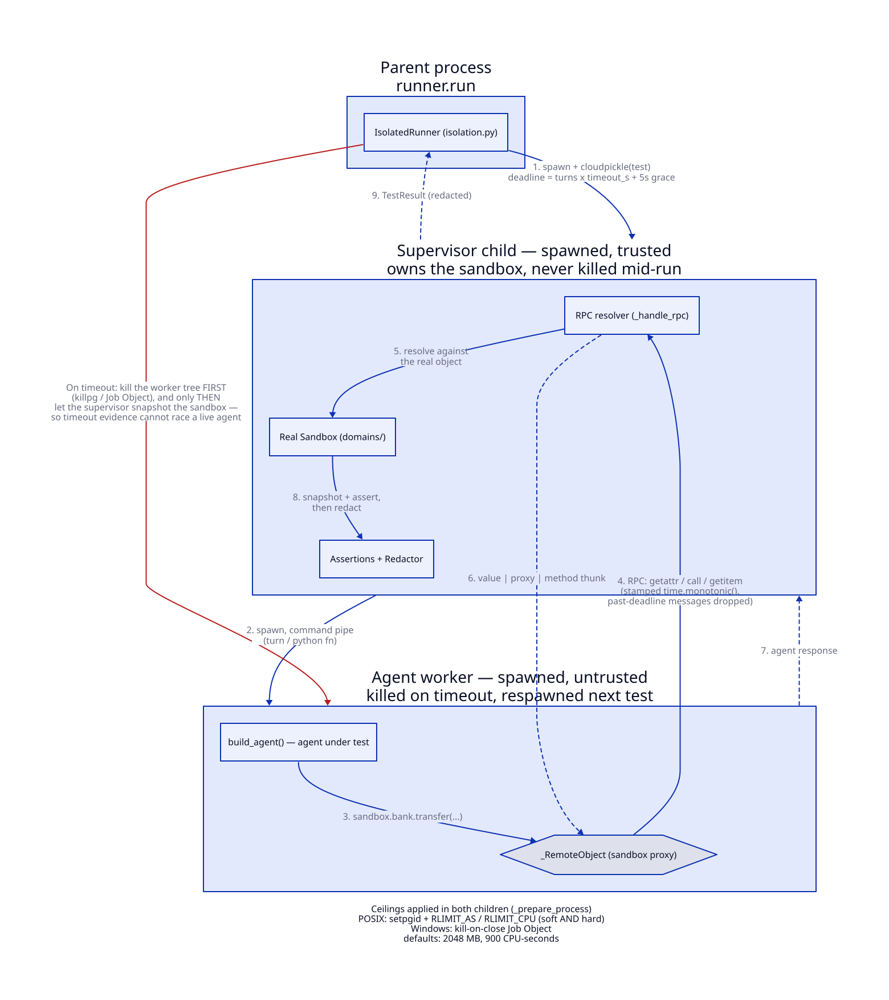

# Isolation — how the harness runs a test

`backend/agentaudit/core/isolation.py`. Read `docs/specs/runner.md` first; this file explains
only the process topology the runner executes inside.

## Why two processes, not one

The tested agent is untrusted code. Two properties are needed at once:

1. **Killability.** A hung or runaway agent must die on a deadline, including any children it
   spawned.
2. **Trustworthy timeout evidence.** When a test times out, the sandbox snapshot must describe
   the world *after* the agent stopped touching it. If the agent were still running while the
   snapshot was taken, the evidence would be a race.

One process cannot do both — whoever owns the sandbox cannot be the thing you kill. So the
harness splits them:

<picture>
  <source media="(prefers-color-scheme: dark)" srcset="../diagrams/isolation-dark.svg">
  <source media="(prefers-color-scheme: light)" srcset="../diagrams/isolation-light.svg">
  
</picture>

Source: [`docs/diagrams/isolation.d2`](../diagrams/isolation.d2) — regenerate both SVG variants
after editing it (see [`docs/diagrams/README.md`](../diagrams/README.md)).

On timeout the *worker* tree is destroyed first; only then does the supervisor snapshot the
sandbox and build the `TestResult`. That ordering is the whole reason for the nesting.

## Lifecycle

`runner.run` constructs one `IsolatedRunner` per run and closes it in a `finally`
(`core/runner.py:336`). Both children are spawned lazily on the first request and reused
across tests — spawn costs ~2.5s on Windows, so the run pays it once, not per test.

Per test (`_run_isolated`, `core/runner.py:277`):

| Step | Where |
| --- | --- |
| deadline = `turns * timeout_s + GRACE_SECONDS` (5s) | parent |
| test pickled with `cloudpickle`, sent over the pipe | parent → supervisor |
| `sandbox.reset()` | supervisor |
| agent turn(s) or Python test fn | worker, proxied |
| assertions + `Redactor` | supervisor |
| `TestResult` pickled back | supervisor → parent |

The grace window exists so worker startup is infrastructure overhead rather than part of the
test's agent budget (`_request`, `isolation.py:528`).

Any failure — spawn error, dead pipe, malformed payload, blown deadline — comes back as an
`IsolationFailure`, which the runner converts to a `Status.ERROR` `TestResult`. Nothing raises
out of `run()`.

## Restart semantics

A timeout or protocol failure kills the worker with `close(kill=True)`. The next test's
`_start` sees a dead process and respawns it. The supervisor — and with it the sandbox and its
accumulated state — survives. A worker crash therefore costs one test, not the run.

## The sandbox RPC proxy

The worker gets `_RemoteObject(session, ())` in place of the sandbox. Every attribute read,
item access, call, `len`, `in`, and iteration becomes a message the supervisor resolves against
the real object (`_handle_rpc`, `isolation.py:225`).

It is a *generic* proxy on purpose: sandboxes declare no tool surface to whitelist against —
agents walk arbitrary paths like `sandbox.bank.transfer` by design.

Encoding rules (`_encode_remote`, `isolation.py:188`):

- scalars (and flat tuples/frozensets of them) cross the wire by value;
- callables come back as a thunk that RPCs on call;
- everything else becomes a proxy pinned to an id-keyed reference, so normal Python reference
  semantics survive even if the containing list or attribute is later replaced.

Sandbox exceptions are returned as strings and re-raised in the worker as `RuntimeError`, so a
tool failure is agent-visible behavior rather than a harness crash.

Each RPC message carries `time.monotonic()` at send. The supervisor drops any message stamped
past the deadline (`_service_rpc`, `isolation.py:455`) — an agent cannot extend its budget by
staying chatty.

## Resource ceilings

`_prepare_process` runs in both children:

- **POSIX** — `setpgid(0, 0)` (so `killpg` reaches the whole tree) plus `RLIMIT_AS` /
  `RLIMIT_CPU`. Both soft *and* hard limits are lowered: agent code runs under the same uid and
  could otherwise raise the soft limit back.
- **Windows** — a kill-on-job-close Job Object with `ProcessMemoryLimit` and
  `PerProcessUserTimeLimit`. The handle stays process-local, which makes an external
  `TerminateProcess` tree-safe.

Defaults: 2048 MB, 900 CPU-seconds. Container-level `pids_limit`/`mem_limit` in
`docker-compose.yml` back these up.

## What this is and is not

**It is killability with resource ceilings. It is not containment.**

Two holes are known and pinned by tests:

- **`sandbox.__class__` reaches this module's globals.** Python resolves class-level dunders
  without calling `__getattr__`, so the proxy's dunder guard cannot see them; it only refuses
  dunders that would be *forwarded* to the supervisor. Pinned by
  `tests/test_isolation.py::test_proxy_class_dunders_are_a_known_isolation_gap`. Closing it
  needs a proxy with no reachable attributes — a design change, not another check.
- **`cloudpickle` deserializes in both children.** Python test functions are arbitrary code by
  construction; the harness is a test tool, not a sandbox for hostile payloads.

The container boundary is what makes those survivable: escalation buys a scratch worker
container with no route to the control plane, not the host. See
[`infra/CLAUDE.md`](../../infra/CLAUDE.md) → "Worker container isolation".

## Tests

`tests/test_isolation.py`. Timeout kills the tree before the snapshot; a worker crash does not
lose the sandbox; proxy reference semantics; the dunder guard and its known gap.
